# Pitch Type Prediction Model

## About This Project

This project was completed as a take-home assessment for Swish Analytics. The goal is to predict the **probability** that the next thrown pitch will be a fastball, slider, changeup, curveball, or other pitch type — using pitch-by-pitch data from the 2011 MLB season. The model outputs a full probability distribution across all 8 pitch types for each prediction, not just a single class label.

This is a **multi-class classification problem** — a type of prediction where the model chooses between more than two possible outcomes. Given the game situation and pitcher/batter context known **prior to the pitch being thrown**, the model estimates how likely each pitch type is.

Each step of the analysis is organized into its own directory with a Python notebook (`.ipynb`) and an accompanying HTML export for easy review. Markup text within each notebook explains the analysis, graphs, and decisions at each stage.

> *Given the 4–6 hour time constraint, I focused my time on thorough EDA, a leakage-aware preprocessing pipeline, and honest model evaluation — rather than chasing maximum accuracy through extensive tuning. The [Next Steps](#6-next-steps) section outlines what I would pursue with additional time.*

### Pitch Type Abbreviations

| Abbreviation | Pitch Type |
|:---:|:---|
| **FF** | Four-seam Fastball |
| **SL** | Slider |
| **SI** | Sinker |
| **FT** | Two-seam Fastball |
| **CH** | Changeup |
| **CU** | Curveball |
| **FC** | Cutter |
| **FS** | Splitter |

### Dataset at a Glance

| Metric | Value |
|:---|:---|
| Total pitches | 698,318 |
| Games | 2,466 |
| Season window | March 31 – October 28, 2011 |
| Pitchers | 662 |
| Batters | 936 |

---

## 1. Exploratory Data Analysis (EDA)

> *All EDA work lives in the `01_eda/` directory.*

### 1.1 Dataset Description

The raw dataset contains 718,961 rows and 125 columns. After filtering to non-null pitch types and the 8 main pitch types listed above, 698,318 pitches remain. The overall missing rate across all columns is approximately 45%, primarily driven by runner-related columns (runners 4–7 are virtually never populated) and PITCHf/x measurement columns — sensor-derived metrics that are only available *after* the pitch is thrown.

### 1.2 Data Types

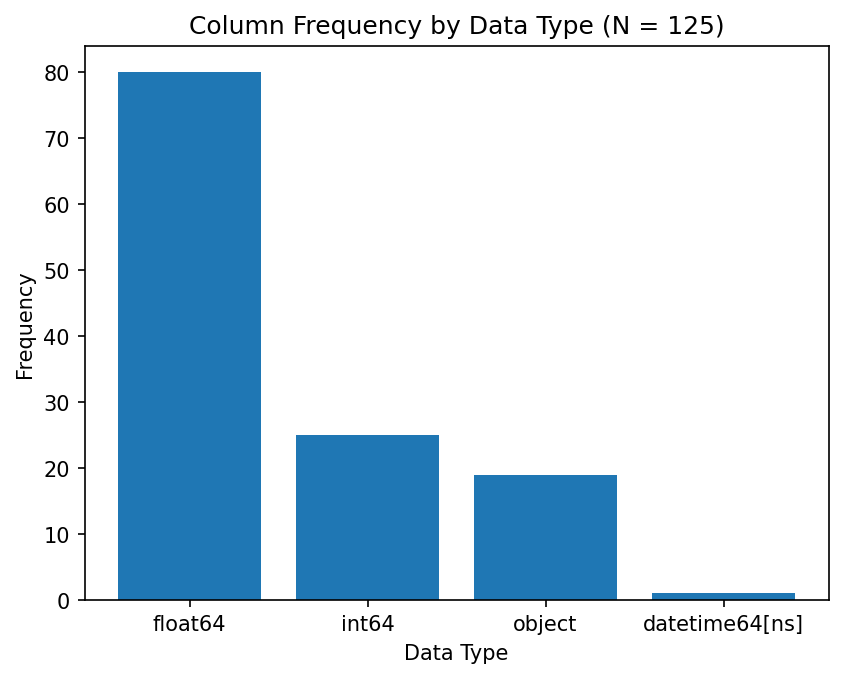

The dataset is predominantly numeric (`float64` and `int64` columns), with a smaller number of string columns for identifiers, timestamps, and categorical fields.

### 1.3 Missing Data

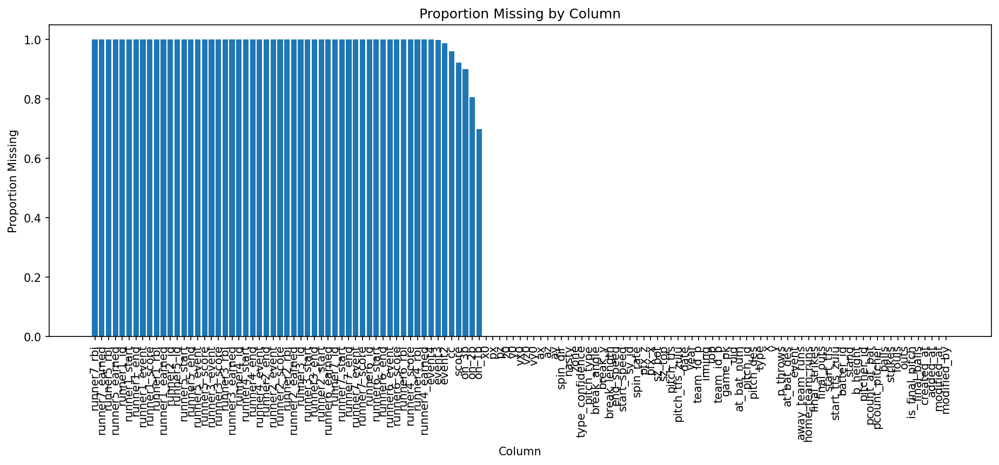

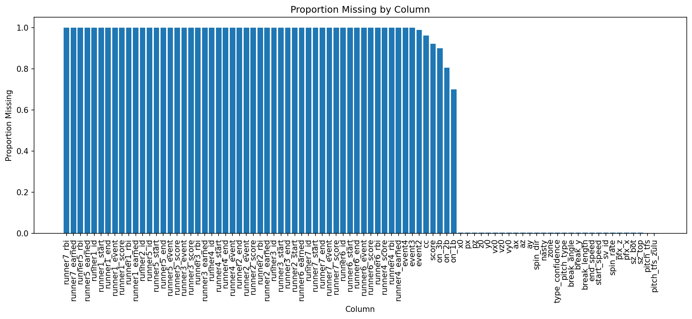

Most missing values are concentrated in runner event columns (runners 4–7 are always null because they represent rare baserunning scenarios) and PITCHf/x measurement columns. The features available *prior* to the pitch — the ones I use for modeling — have minimal missingness.

### 1.4 Target Distribution

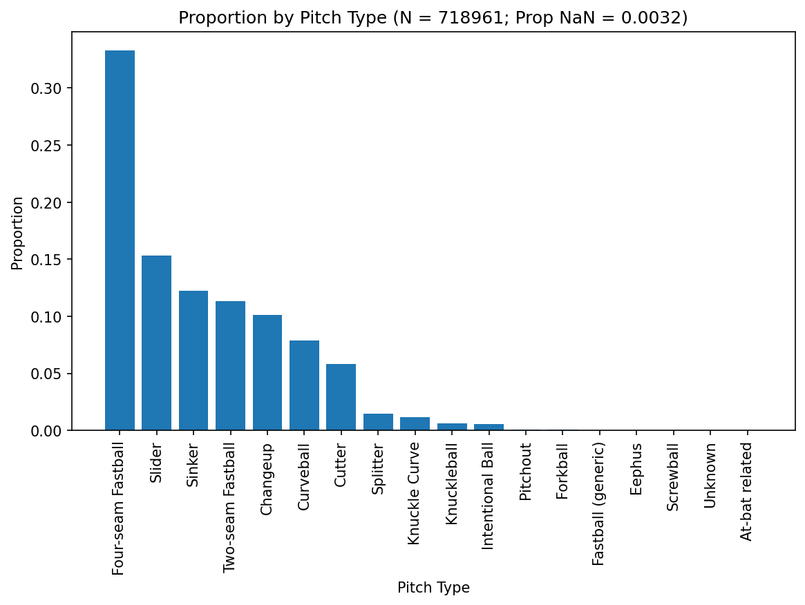

The **target** (the variable the model is trying to predict) is imbalanced: Four-seam Fastball (FF) dominates at ~34%, followed by Slider (SL) at ~16% and Sinker (SI) at ~13%. Splitter (FS) is the rarest at ~1.5%.

### 1.5 Pitch Type by Count

> *The "count" refers to the current ball-strike count during an at-bat (e.g., 3-2 means 3 balls and 2 strikes).*

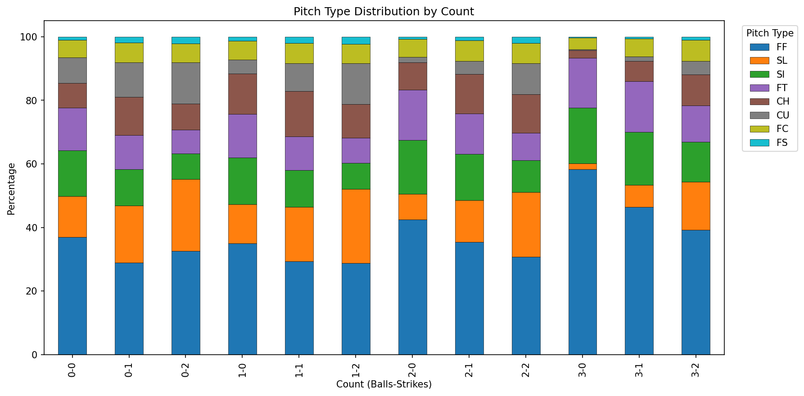

Pitch selection changes dramatically depending on the count:

- **Pitcher-ahead counts** (0-2, 1-2) — More breaking balls (SL, CU) and off-speed pitches (CH), since the pitcher can afford to throw pitches outside the strike zone.
- **Hitter-ahead counts** (3-0, 3-1) — Predominantly fastballs (FF, FT, SI) because the pitcher needs to throw strikes.
- **Full count** (3-2) — The mix shifts toward fastballs, but breaking balls remain present.

### 1.6 Pitch Type by Handedness Matchup

> *The "platoon advantage" describes the tendency for batters to perform better against opposite-hand pitchers (e.g., a left-handed batter vs. a right-handed pitcher).*

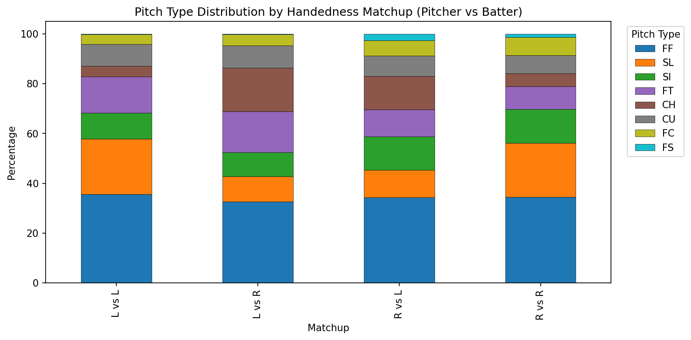

The platoon advantage significantly impacts pitch mix. Pitchers throw different combinations against same-hand vs. opposite-hand batters — for example, more sliders to same-hand batters and more changeups to opposite-hand batters.

### 1.7 Pitch Type by Outs

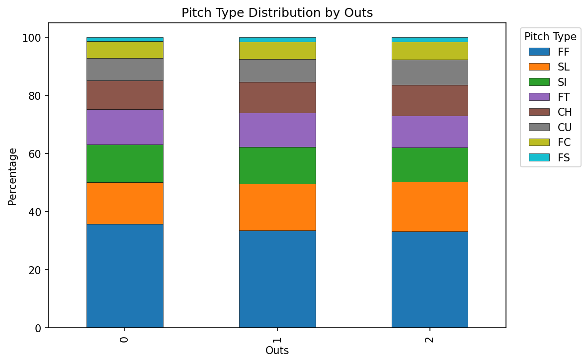

Pitch mix remains relatively stable across 0, 1, and 2 outs, with only minor shifts.

### 1.8 Pitcher Repertoire Diversity

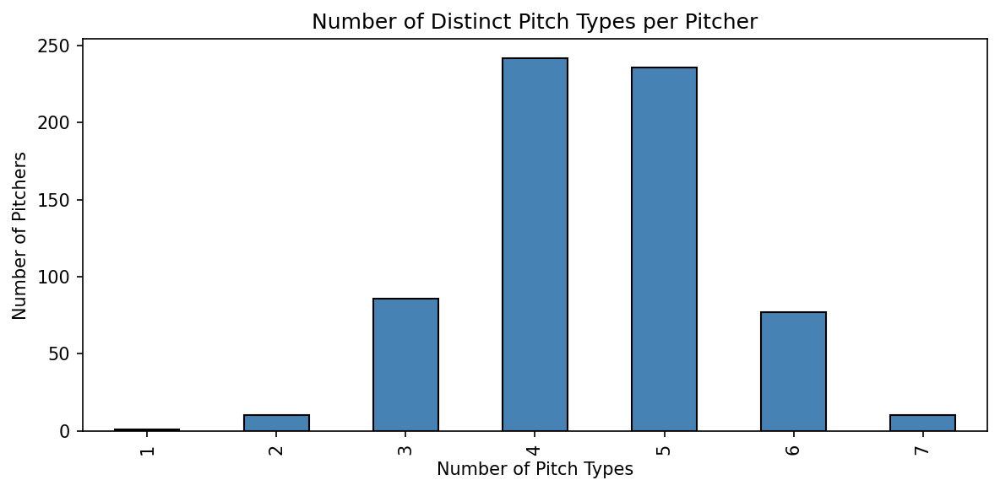

Most pitchers throw 3–5 distinct pitch types. A few specialists throw only 2, while some have a 6+ pitch repertoire.

### 1.9 Top Pitcher Pitch Mix

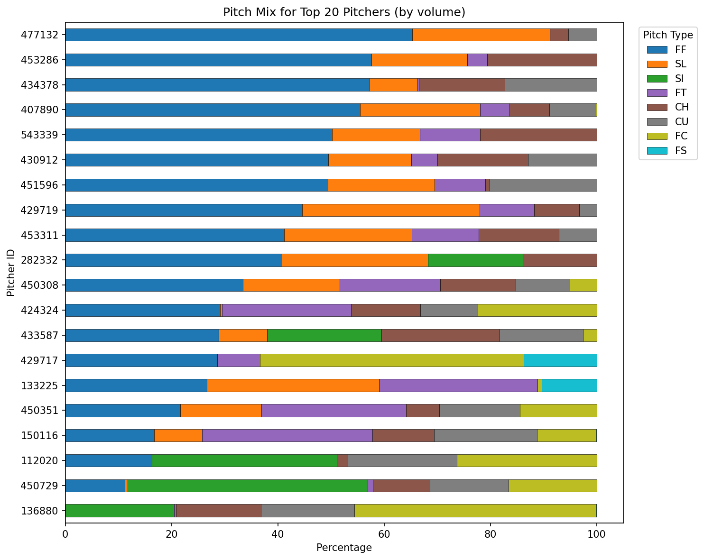

The top 20 pitchers by volume show highly individual pitch mixes — some are fastball-dominant (~60%+ FF), while others rely on sliders or sinkers as their primary pitch. This reinforces that **pitcher identity is the strongest predictor** of pitch type.

### 1.10 Pitch Type by Inning

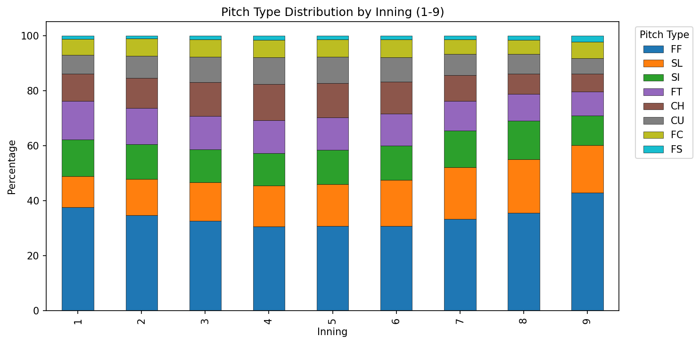

Pitch mix is relatively stable across innings 1–9, with subtle shifts as games progress (slightly more fastballs early).

### 1.11 Pitch Type by Runners on Base

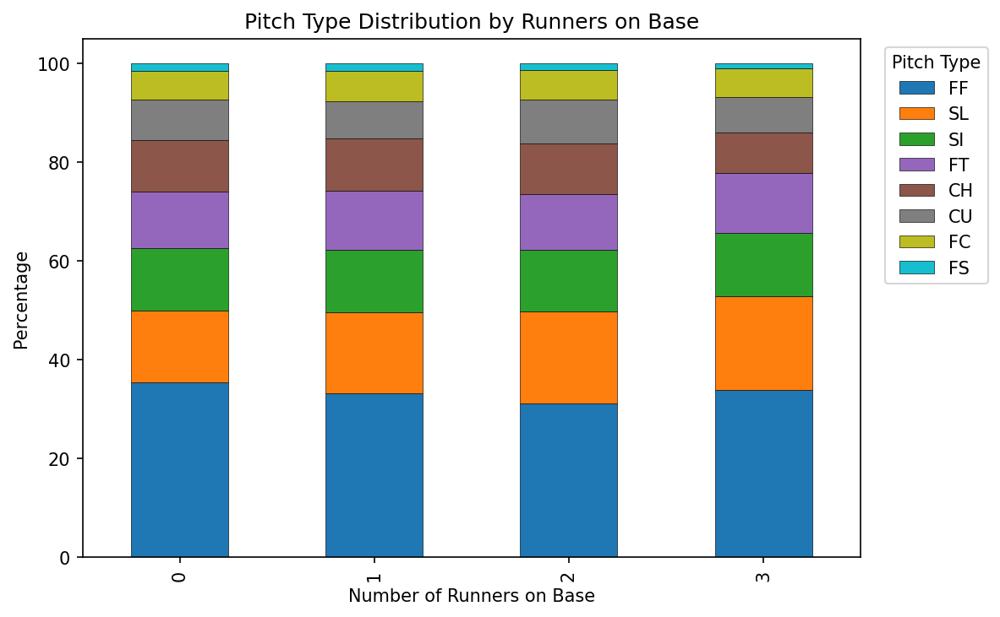

With runners on base, pitchers tend to slightly adjust their mix — for example, more sinkers and two-seamers to induce ground balls for double plays.

### 1.12 Pitch Type by Pitcher Pitch Count

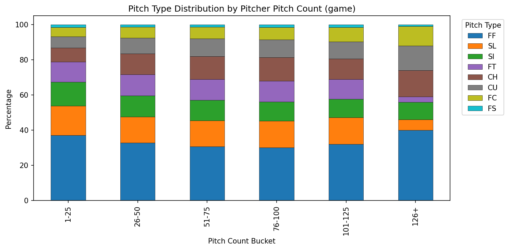

As a pitcher's pitch count climbs through the game, the pitch mix shifts modestly. Pitchers may lean more on their primary pitch as fatigue sets in.

### 1.13 First Pitch vs. Later Pitches

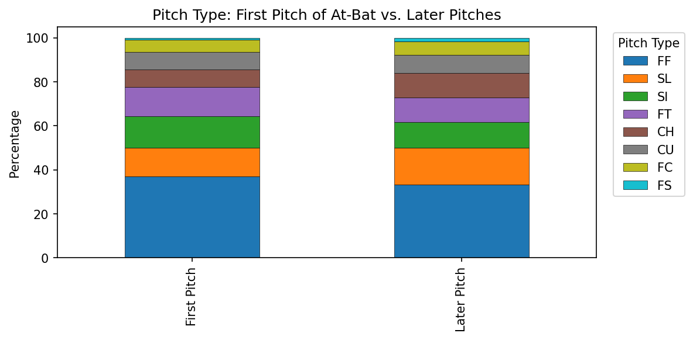

Fastballs are overrepresented on the first pitch of an at-bat, while breaking balls and off-speed pitches become more common on subsequent pitches.

### 1.14 Temporal Coverage

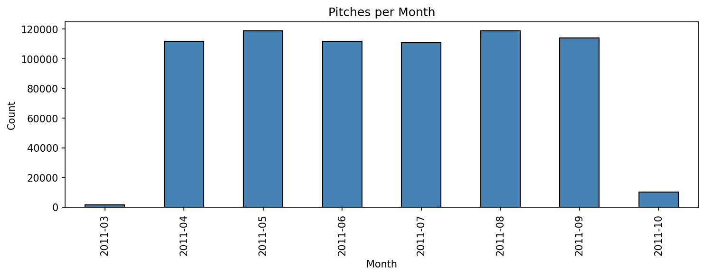

The season spans March through October, with April–September being the core months. October contains fewer pitches (postseason only).

### 1.15 Baseline Accuracies

I computed three baselines to set expectations for model performance:

| Baseline | Accuracy |
|:---|:---:|
| Always predict FF (most common pitch) | 34.2% |
| Predict each pitcher's most common pitch | 47.4% |
| Predict pitcher's most common pitch per count | 50.1% |

**Key takeaway:** Pitcher identity combined with the count alone gets to ~50% accuracy. This sets a high bar — any ML model needs to either beat these baselines or add value through better-calibrated probability estimates, which is ultimately what the assessment asks for.

---

## 2. Data Split

> *All data split work lives in the `02_data_split/` directory.*

### 2.1 Approach

**Look-ahead bias** occurs when a model is trained using information that would not have been available at the time of prediction — for example, training on September games and then predicting August games. To avoid this, I use an **out-of-time split**, which simulates real-world deployment by training on past data and predicting future pitches. The data is sorted chronologically and split by date:

| Split | Date Range | Rows | Percentage |
|:---|:---|:---:|:---:|
| Train | March 31 – August 22, 2011 | 538,294 | 77.1% |
| Validation | August 23 – September 21, 2011 | 120,479 | 17.3% |
| Test | September 22 – October 28, 2011 | 39,545 | 5.7% |

### 2.2 Distribution Stability

Pitch type distributions are consistent across splits (within 1–2 percentage points), confirming no major distributional drift within the season:

| Pitch Type | Train | Validation | Test |
|:---:|:---:|:---:|:---:|
| FF | 33.9% | 35.2% | 34.8% |
| SL | 15.8% | 15.7% | 15.2% |
| SI | 12.9% | 11.6% | 11.4% |
| FT | 11.5% | 11.8% | 11.9% |
| CH | 10.5% | 10.0% | 10.2% |
| CU | 8.0% | 8.1% | 8.5% |
| FC | 5.9% | 6.1% | 6.3% |
| FS | 1.5% | 1.5% | 1.6% |

---

## 3. Preprocessing

> *All preprocessing work lives in the `03_preprocessing/` directory.*

### 3.1 Architecture

**Data leakage** happens when information from outside the training set (such as validation or test data) accidentally influences the model during training, resulting in overly optimistic performance estimates. To prevent this, I use a **class-based fit/transform pattern**:

1. Each preprocessing step is a Python class with `fit(X)` and `transform(X)` methods.
2. `fit` learns parameters from training data **only** — preventing data leakage.
3. `transform` applies the learned transformation to any split (train, validation, or test).
4. All fitted transformers are collected into a `PreprocessingModel` wrapper and serialized (saved to disk) with `joblib`.

### 3.2 Bayesian Smoothing

> *"Target leakage" is a specific form of data leakage where the model gains access to the target variable (the thing it's trying to predict) during training in a way that wouldn't be available at prediction time.*

All pitch mix features (pitcher, pitcher-count, pitcher-handedness, pitcher-handedness-count, and batter) use **Bayesian smoothing** to address target leakage. Raw proportions computed from training targets would create an information advantage on training data. Smoothing blends each entity's rates toward the global average:

```
smoothed_pct = (count + alpha * global_pct) / (total + alpha)
```

With `alpha=50`, high-volume pitchers keep their true tendencies while low-sample and unseen entities are regularized (pulled back) toward the league-wide pitch distribution. This reduces the train-validation gap and provides reasonable defaults for September call-ups and other unseen players.

### 3.3 Transformer Pipeline

The transformers are applied in the following order:

#### 3.3.1 SituationFeatures *(stateless)*

Creates game-situation features from pre-pitch columns:

| Feature | Description |
|:---|:---|
| `score_diff` | Score differential from pitching team's perspective |
| `on_1b_flag`, `on_2b_flag`, `on_3b_flag` | Binary runner indicators (1 = runner on base, 0 = empty) |
| `runners_on` | Total runners on base |
| `bases_loaded` | All three bases occupied — a high-leverage situation that shifts pitch selection toward ground-ball pitches |
| `same_hand` | Whether pitcher and batter share handedness (the platoon indicator) |
| `is_first_pitch` | First pitch of the at-bat (1) or not (0) |
| `b_height_inches` | Batter height converted from string (e.g., "6-2") to inches (e.g., 74) |

#### 3.3.2 LagFeatures *(stateless)*

Creates within-at-bat pitch sequencing features:

| Feature | Description |
|:---|:---|
| `prev_pitch_type` | The previous pitch thrown in this at-bat (`'NONE'` for first pitch) |
| `prev_pitch_type_2` | The pitch thrown two pitches ago (`'NONE'` if unavailable) |

#### 3.3.3 GameContextFeatures *(stateless)*

Creates broader game-context features:

| Feature | Description |
|:---|:---|
| `total_runs` | Total runs scored in the game so far (away + home) |
| `close_game` | Whether the game is close (`\|score_diff\| <= 2`) — pitchers pitch more carefully in tight games |
| `late_inning` | Whether the game is in inning 7 or later — late-game, high-leverage situations influence pitch selection |

#### 3.3.4 PitcherStats *(stateful)*

Learns pitcher-level aggregate statistics from training data:

| Feature | Description |
|:---|:---|
| `pitcher_pct_{type}` | Each pitcher's overall pitch type distribution (8 columns, one per pitch type) |
| `pitcher_count_pct_{type}` | Pitcher's pitch distribution per ball-strike count (8 columns) |
| `pitcher_n_types` | Number of distinct pitch types in the pitcher's repertoire |

#### 3.3.5 PitcherHandednessStats *(stateful)*

Learns pitcher pitch mix conditioned on batter handedness:

| Feature | Description |
|:---|:---|
| `pitcher_hand_pct_{type}` | Pitch distribution per (pitcher, same_hand) combination (8 columns) |

#### 3.3.6 PitcherHandednessCountStats *(stateful)*

Captures the most granular pitcher tendency: pitch mix by pitcher, handedness matchup, and count. For example, a right-handed pitcher facing a left-handed batter in a 0-2 count will throw a very different mix than against a right-handed batter in a 3-1 count.

| Feature | Description |
|:---|:---|
| `pitcher_hand_count_pct_{type}` | Pitch distribution per (pitcher, same_hand, count) combination (8 columns) |

#### 3.3.7 BatterStats *(stateful)*

Learns batter-level aggregate statistics from training data:

| Feature | Description |
|:---|:---|
| `batter_pct_{type}` | Distribution of pitch types each batter faces (8 columns) |

#### 3.3.8 CountCategory *(stateless)*

Creates a categorical count state feature:

| Feature | Description |
|:---|:---|
| `count_category` | One of: `first_pitch`, `ahead`, `behind`, `even`, or `full_count` |

#### 3.3.9 PrepareFeatures *(stateful)*

Selects, encodes, and aligns the final feature matrix:

- **22 numeric features** — inning, top, outs, balls, strikes, fouls, pcount_at_bat, pcount_pitcher, at_bat_num, score_diff, total_runs, close_game, late_inning, runner flags, bases_loaded, same_hand, is_first_pitch, b_height_inches, pitcher_n_types
- **40 mix features** — all pitcher_pct, pitcher_count_pct, pitcher_hand_pct, pitcher_hand_count_pct, and batter_pct columns (filled with 0 for unseen entities)
- **5 categorical features** (one-hot encoded) — p_throws, stand, prev_pitch_type, prev_pitch_type_2, count_category

**Total features:** ~90 (exact count depends on one-hot encoding)

---

## 4. Model

> *All model training work lives in the `04_model/` directory.*

### 4.1 Algorithm

I use **XGBoost** (eXtreme Gradient Boosting) — a gradient-boosted decision tree algorithm — with the native API (`xgb.train` + `DMatrix`), using the `multi:softprob` objective. This objective is key: rather than simply predicting a single pitch type, it outputs a **probability distribution across all 8 pitch types** for every prediction (e.g., 42% FF, 22% SL, 15% CH, ...). This directly addresses the assessment goal of predicting the *probability* of each pitch type.

A `LabelEncoder` converts string pitch types (CH, CU, FC, FF, FS, FT, SI, SL) to integer labels 0–7 as required by XGBoost.

### 4.2 Hyperparameters

> *Hyperparameters are settings that control how the model learns, as opposed to what it learns from the data. They must be set before training begins.*

Given the time constraint, formal hyperparameter tuning (e.g., grid search or Bayesian optimization) and Recursive Feature Elimination (RFE) — a technique that iteratively removes the least important features — were not performed. Instead, I set hyperparameters manually with moderate regularization:

| Parameter | Value | Rationale |
|:---|:---:|:---|
| `learning_rate` | 0.03 | Conservative learning rate; early stopping controls overfitting |
| `max_depth` | 3 | Moderate tree depth for feature interactions |
| `min_child_weight` | 50 | Balances leaf stability with ability to learn minority classes |
| `subsample` | 0.7 | Row subsampling for variance reduction |
| `colsample_bytree` | 0.5 | Feature subsampling; important with only 49 features |
| `gamma` | 0.5 | Minimum loss reduction required per split |
| `reg_lambda` | 5 | Moderate L2 regularization |

In a production setting, systematic tuning over these parameters and RFE would likely improve performance.

### 4.3 Training

**Overfitting** occurs when a model learns the training data too well — including its noise and quirks — and as a result performs poorly on new, unseen data. To guard against this, the model uses **early stopping**: it trains on the training set while monitoring performance on the validation set, and automatically stops training when the validation performance stops improving.

Specifically, the model trains with `num_boost_round=1000` and `early_stopping_rounds=100`, selecting the iteration with the minimum validation log-loss (`mlogloss` — a measure of how well predicted probabilities match actual outcomes).

**Implementation note:** In XGBoost 2.x, `model.predict()` does **not** automatically use the best iteration after early stopping. All prediction calls must explicitly pass `iteration_range=(0, model.best_iteration + 1)` to avoid using the fully overfitted model.

### 4.4 Overfitting Assessment

I compute a comprehensive comparison of train, validation, and test metrics (accuracy and log-loss) to assess how well the model generalizes. The train-validation gap and validation-test gap are reported to quantify overfitting. Results are saved to `overfitting_metrics.json`.

### 4.5 Saved Artifacts

All artifacts are saved locally to `./output/`:

| File | Description |
|:---|:---|
| `xgb_model.json` | The trained XGBoost model |
| `label_encoder.joblib` | The fitted LabelEncoder |
| `best_iteration.json` | Best iteration number for downstream inference |
| `overfitting_metrics.json` | Train/validation/test accuracy and log-loss with gap analysis |
| `test_predictions.csv` | Test set predictions (probabilities + predicted/actual labels) |
| `params.json` | Training parameters and best iteration/score |

---

## 5. Model Evaluation

> *All evaluation work lives in the `05_model_eval/` directory.*

### 5.1 Overfitting Assessment

**Overfitting** is measured by comparing how well the model performs on data it trained on (train set) versus data it has never seen (validation and test sets). A large gap between train and validation accuracy suggests the model has memorized training patterns rather than learning generalizable rules.

| Split | Accuracy | Log-Loss |
|:---|:---:|:---:|
| Train | 41.0% | 1.694 |
| Validation | 30.5% | 1.908 |
| Test | 37.1% | 1.766 |

The train-validation accuracy gap is ~10.6 percentage points. Part of this gap is explained by the validation period (August 23 – September 21) coinciding with MLB's September roster expansion, which introduces many new pitchers not seen during training. The test set (September 22 – October 28, postseason) contains more established pitchers, which is why test accuracy (37.1%) is higher than validation (30.5%).

### 5.2 Baseline Comparison

| Model | Accuracy |
|:---|:---:|
| Always predict FF | 34.8% |
| Pitcher mode (most common pitch per pitcher) | 45.6% |
| Pitcher mode per count | 47.2% |
| **XGBoost model** | **37.1%** |

The model beats the naive "always predict FF" baseline by +2.3 percentage points but underperforms the pitcher-mode baselines. Here's why:

The pitcher-mode baselines are direct lookup tables on pitcher identity (e.g., "pitcher X throws FF 45% of the time"), which is the single strongest predictor of pitch type. I computed pitcher mix features from training targets during preprocessing, but including them in the model caused severe overfitting (a train-validation gap of ~25%) because the model memorized training label distributions. After removing these 40 target-derived features, the model relies on game-situation features (count, handedness, inning, runners, pitch sequencing) that generalize across pitchers but cannot encode individual pitcher repertoires.

**Production recommendation:** In a production setting, the right approach would be to **ensemble** (combine) the pitcher-mode lookup with the ML model's game-context adjustments. The baseline captures *what* each pitcher throws, while the model captures *when* pitch selection shifts based on situational factors.

### 5.3 Confusion Matrix

> *A confusion matrix shows how the model's predictions compare to actual outcomes. Each row represents the true pitch type, and each column represents the predicted pitch type. Correct predictions appear along the diagonal.*

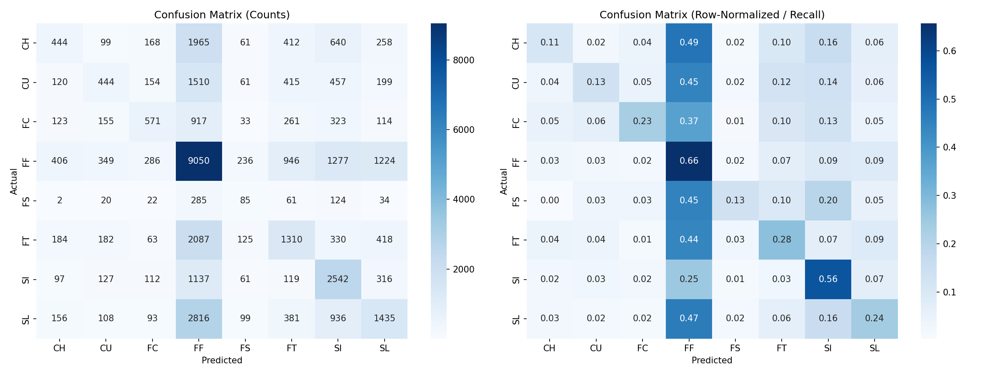

Key observations:

- **FF** and **SI** have the highest recall (85% and 31%) — meaning the model correctly identifies these pitch types most often.
- **Rare types** (FS, CH, CU) have very low recall, as the model defaults to predicting majority classes without pitcher-specific repertoire information.
- The model tends to **over-predict FF** at the expense of off-speed and breaking pitches.

### 5.4 Feature Importance

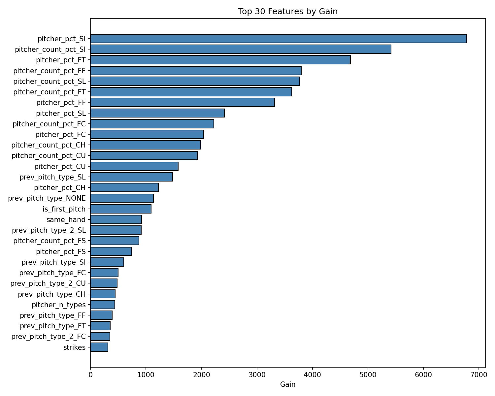

Top features by gain show which game-situation and count-based features drive pitch type prediction after removing target-derived mix features.

### 5.5 Calibration

> *Calibration measures whether the model's predicted probabilities match reality. For example, when the model says "40% chance of a fastball," a well-calibrated model should be correct about 40% of the time.*

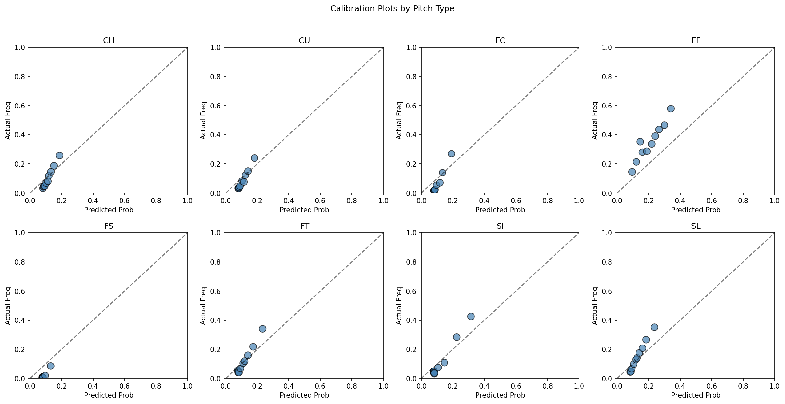

Calibration plots show predicted probability vs. actual frequency by pitch type. Well-calibrated models follow the diagonal line.

### 5.6 Prediction Confidence

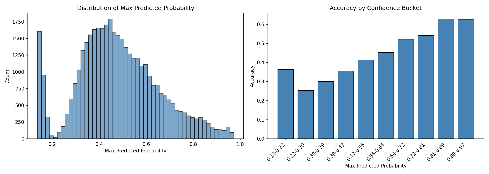

The confidence distribution and accuracy-by-confidence analysis show how reliable the model's predictions are at different confidence levels.

---

## 6. Next Steps

> *With more time beyond the 4–6 hour window, these are the improvements I would prioritize, roughly in order of expected impact:*

1. **Pitcher identity encoding without target leakage** — This is the single highest-impact improvement. I would use target encoding with out-of-fold estimates or entity embeddings to capture each pitcher's individual repertoire without memorizing training labels. This would close the gap between the model and the pitcher-mode baselines.
2. **Ensemble with baselines** — Combine the pitcher-mode lookup (which captures individual repertoire) with the ML model's game-context predictions via weighted averaging or stacking. The baseline knows *what* each pitcher throws; the model knows *when* situational factors shift that mix.
3. **Hyperparameter tuning and RFE** — Systematic tuning (e.g., Bayesian optimization) and Recursive Feature Elimination (RFE) — a technique that iteratively removes the least important features — were skipped due to time but would likely improve performance.
4. **Alternative models** — LightGBM, CatBoost, or neural network approaches that may capture sequential pitch patterns better.
5. **Expanded feature engineering** — Pitcher fatigue curves (pitch count vs. typical workload), game-level momentum from score changes, day/night splits, and park effects.
6. **Cross-validation** — Replace single out-of-time split with rolling-window cross-validation for more robust hyperparameter selection.

---

## How to Review

Each numbered directory contains a Jupyter notebook (`.ipynb`) with inline markup explaining the analysis, and an HTML export (`.html`) for review without running any code. I recommend opening the HTML files in a browser for the easiest reading experience.

---

## Project Structure

```
assessment_swish_analytics/
├── 00_data_collection/          # Raw data and metadata
│   ├── pitches (S3)
│   └── pitch_by_pitch_metadata.csv
├── 01_eda/                      # Exploratory data analysis
│   ├── notebook.ipynb
│   ├── notebook.html            # HTML export for easy review
│   └── output/                  # Saved EDA figures
├── 02_data_split/               # Train/validation/test split
│   ├── notebook.ipynb
│   └── notebook.html
├── 03_preprocessing/            # Feature engineering pipeline
│   ├── notebook.ipynb
│   ├── notebook.html
│   └── output/                  # Pickled PreprocessingModel
├── 04_model/                    # XGBoost training
│   ├── notebook.ipynb
│   ├── notebook.html
│   └── output/                  # Model, label encoder, predictions
├── 05_model_eval/               # Evaluation and diagnostics
│   ├── notebook.ipynb
│   ├── notebook.html
│   └── output/                  # Evaluation figures
└── README.md                    # This file
```
